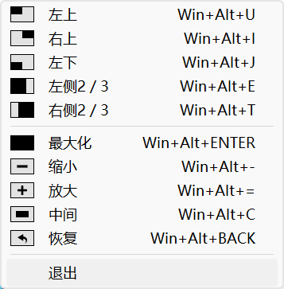

# Zephyr

这是一个受到 [Rectangle](https://github.com/rxhanson/Rectangle) 项目启发在windows上的简易实现的学习项目

> 因为 windows 下已经存在非常好用的窗口管理快捷键，此项目只实现以下快捷键：

* 左上（win+alt+u）
* 右上（win+alt+i）
* 左下（win+alt+i）
* 左侧 2/3（win+alt+e）
* 右侧 2/3（win+alt+t）
* 恢复（win+alt+back）
* 最大化（win+alt+enter）
* 缩小（win+alt+-）
* 放大（win+alt+=）
* 中间（win+alt+c）

注意：运行需要使用管理员权限,不然有些窗口无法调整大小和位置

# 1 如何运行本项目

## 1. 本项目所使用开发工具

[aardio](https://www.aardio.com/) 历经 20 年活跃更新。小轻快，永久免费。

## 2. 运行

1. 在官网上下载 <code>aardio</code> <code>aardio</code> 工具打开本项目
2. 打开 <code>main.aardio</code> 文件，按下 <code>F5</code> 即可

# 2 本项目存在问题

1. 未监听窗口销毁钩子，当存在大量的窗口创建和销毁时，会造成微小内存泄漏，重启软件即可释放
2. 未监听页面退出，用于清理注册的钩子（系统自动回收）
3. 暂时没有拦截快捷键的继续传递
4. 未捕获程序错误

# 3 本项目内部有哪些功能(学到了什么)

1. 
2.

# 4 

# 致谢

1. 感谢 [Rectangle](https://github.com/rxhanson/Rectangle) 仓库中的右键菜单 png 图标,已作为本程序的[右键菜单的图标](/res//Positions/)
2. 感谢 [Mozilla](https://github.com/mozilla/fxemoji) 仓库提供的开源图标，已作为本程序的[应用程序图标](https://github.com/mozilla/fxemoji/blob/gh-pages/svgs/objects/u1F5B5-screen.svg)
3. 感谢 [aardio](https://www.aardio.com/) 提供的如此简单的windows开发工具，分分钟写出一个windows桌面程序，体积还格外小，实在是太爽快了